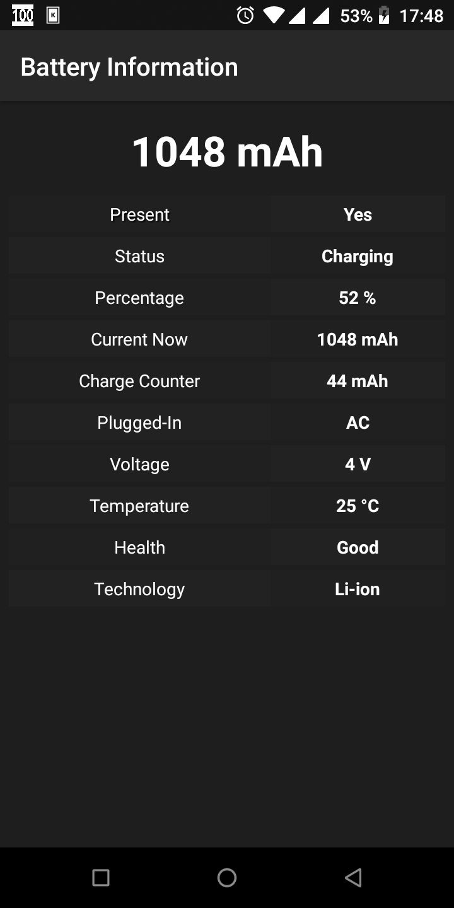

# Battery Information

Battery Information to view your Android device battery information, such as

- Charging State
* Charge Percentage
* Current Amount at Present
* Plugged in State
* Voltage
* Battery Temperature
* Battery Health
- Battery Technology

**Battery Information - Android View**

